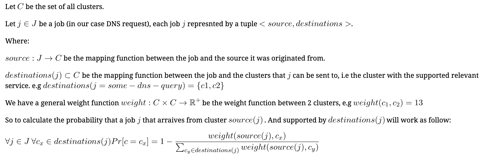

# Multi-Cluster Service Selection Optimization - EP

## Motivation

While the world is moving towards micro-services application based architecture, more organizations combine multi-cluster and multi-cloud providers for redundancy, performance, management, and other reasons.
We would like to optimize the total cost of a Kubernetes deployment in means of communication between multi-clusters, given that we could decide between different approaches. The three approaches possible, currently, are optimizing the full service chain of a single app/deployment, multiple apps/deployments, or a smart local optimization per cluster point of view, without building the full service chain.
In this Enhancement Proposal, we shall introduce questions, ideas, and requirements to optimize the service selection mechanism of the Lighthouse Plugin.

### Objective
We  wish  to  design a decentralized solution for optimizing the `cost` (explanation to follow) of service to service traffic according to the kubernetes operator needs.

The objective will be splited into 3 stages, to enable 3 kinds of load balancing (will be described in the design part)

1. Round Robin - The default load balancer - already implemented
1. Weighted Round Robin
1. Optimized Load Balancer

### Requirements
1. Generic cost function:
  1. Cost parameters:
      1. Latency
      1. RTT
      1. Networking cost
      2. Later stages:    
        1. Network congestion
  1. Simple cost function - the operator will be able to mark the trade offs between, for example sucrafise latency for better pricing. best performance, etc
1. Service and Cluster Health/Avialbility indication - We would like to monitor clsuters and services for availability and health
1. Decentralization:
  1. Each cluster should make independent service selection/routing decision  
  2. Avoid herd behavior and server starvation
  3. Adaptive - Make the system as adaptive as possible for changes such as demand, outage, bugs , etc
  4. Minimal data sharing / data collection between the clusters
1. Topology - Local, optimizaing only next hop - i.e without any relation to the full application graph, simple yet naive approach.

### Design Details
As we would like to comply with the Kubernetes KEP for the Multi-Cluster API, and the current implementation, we would like to offer a simple lightweight solution for selecting a service from a given pool.

#### Basic API and features

Allow the operator a simple way to indicate on the desire load balancer for service discovery, with optimal parameters through the `Submariner CRD`.

1. Option 1 - Add the following properties:
  1. `serviceDiscoveryLoadBalancing: [round-robin, weighted-round-robin, optimized]`
  2. `optimizedLoadBalancingPrams: [cost, performance, mixed]`

`cost` - will optimized communication cost
`performance` - will optimized performance (latency and rtt wise)
`mixed` - will try to reach balance between minimal cost and best performance

`serviceDiscoveryLoadBalancing` is relevant only for `serviceDiscoveryEnabled: true`
`optimizedLoadBalancingPrams` is relevant only for `serviceDiscoveryLoadBalancing: optimized`

##### Future API support
We would like to enhance the subctl/helm.operator `join` command and allow additional flag to set minimal traffic between certain services and clsuter, this will also might require extension of the `ServiceExport` API. For example to indicate a certain service import suppose to get 10% of the traffic. But this is for later stages and will be covered in separate EP and depends on acceptance of `ServiceExport` API changes.

#### Implementation

All load balancing techniques are working in a stochastic coordination and using probablity to avoid herd behavoir and server starvation, some are more prune to errors than others and their performance and resilience shall be tested according to the testing plan provided in the following section.

1. Round Robin - A simple load balancing technique, which is alrady implemented in the current `Lighthouse` plugin setup which distributes the load between service exports equally in exception. [1](https://en.wikipedia.org/wiki/Round-robin_scheduling), [2](https://github.com/hlts2/round-robin/blob/master/round_robin.go), [3](https://www.sciencedirect.com/science/article/pii/S0377221707005309?casa_token=hTjh_nLy2EYAAAAA:OdwozJnXVt-9_irMbAt60zsRCCjCAC8MXTYpV5nKvqXihMtWpPf46VxuhCzIITJdkjZIieyAd37Z)

1. Weighted Round Robin - The next stage of improving the Round Robin load balancing, where each service import will be assign with a weight according to predefine parameters (e.g latency, rtt, pricing etc), the `lower` the weight the `higher` the probability to `select` that specific service, in such way in expectation the traffic will distribute according to the weight.
[1](https://en.wikipedia.org/wiki/Weighted_round_robin),[2](https://ieeexplore.ieee.org/abstract/document/7034709)
For example we have a system with 3 clusters (c1,c2,c3) and 2 exports for `service-1` from 2 clusters (c2,c3) in each cluster we will assign an appropriate weight for each export. An option will be `c1 {c2: 10, c3: 5}` (note that c1 does not have a local version of `service-1`), `c2 {c2: 0, c3: 4}`, `c3 {c2: 4, c3: 0}`.
Now lets take cluster `c1` for example that needs to distribute the load between `c2` and `c3` for `service-1`. in expectation over time a `1/3` (33%) of the traffic will be passed to `c3` and `2/3` (67%) will be passed to `c2` - in opposite of their weight.
The formula to calculate the probability will work as follow:

Note about `zero weight` (`weight=0`). We have already implemented a mechanism that prefer local cluster service over remote ones, using `lower` weight -> `higher` probability we will make a safety mechanism to return the cluster with the `weight=0` always probability will equal = 1.
For safety, we will not allow more than 1 cluster to have `weight=0`.

1. Optimized
  1. Stochastic coordination - based on probability - to avoid herd behavior and server starvation
  2. Rounds based - to enable enough time to gather and share information between the clusters
  3. Cost function should use Multi-Objective optimization techniques
  4. Using classic optimization techniques and define a load balancing like optimization problem
  5. Serivce / Cluster will have a configured capacity according to the number of pods (or any other indication we can retrieve)

Specification of model will depend implementation and testing

#### Testing

Besides implementing Unitests and E2E tests which will be configured according to the load balancing algorithm during the actual implementation process. We plan on experimenting with as close to possible real life scenarios.

##### Optimization Objective Variables
1. RTT -> Latency:
Latency between Data Centers is usually [steady](http://kth.diva-portal.org/smash/get/diva2:1334280/FULLTEXT01.pdf). Unpredicted events both in the network layer (packet loss, rate limiting, delays due to congestion and more), as well as application layer and system related events (killing/replacing containers, disconnecting cluster and nodes, application bugs more) can cause latency and connectivity issue [TODO - citation]. There are numerous models and distributions for different disruptions and we plan to use [Pumba](https://github.com/alexei-led/pumba) which is a chaos testing tool for Docker container. It allows to perform network emulation and application disruptions.
It uses tools such as [iproute2](https://wiki.linuxfoundation.org/networking/iproute2) and [c-netem](https://man7.org/linux/man-pages/man8/tc-netem.8.html).

1. Pricing: One of the key objectives in this EP is to improve the price one pays for service to service communication. While measuring the actual pricing is a complicated function to build, of different variables such as egress/ingress traffic between in-zone,out-zones/cloud providers, load balancing pricing overhead (if traffic goes through a dedicated load balancer it could impose extra charges), adaptive pricing (more traffic the price gets lower per GB), VPC pricing, Firewalls, pre-defined discounts, additional overlay services around the networking layer and more. [1](https://cloud.google.com/vpc/network-pricing), [2](https://cloud.google.com/products/calculator), [3](https://cloud.google.com/api-gateway/docs/pricing), [4](https://www.cloudmanagementinsider.com/data-transfer-costs-everything-you-need-to-know/), [5](https://aws.amazon.com/blogs/aws/aws-data-transfer-prices-reduced/),
We plan to break this part into several stages, which will allow more robust and smart price optimization.
On our first stage we plan to introduce a very simple and static model.
Price in US Dollars($), for egress/ingress price per cloud provider/zone.

1. To be considered:
  1. Turnaround time - is the total time that it takes between a submission of a request and the return of the complete response to the customer. This is the main metric for users experience we would like to optimize it, as it derived from many of the variables we mentioned above (latency/RTT/Application) on one hand, but from the other we are not sure yet, on how to fit it in our one hop model, we would tackle this parameter in the future.
  1. Jitter Delay

##### Optimization Objective Constraints

1. Capacity - Our main constraint to the optimization problem. Generally speaking we would like to measure it by RPS. Our plan is to deduce such capacity according to the pod count of each service in each cluster.
As we are aware that enforcing capacity in such way is kind of stepping into Service Mesh territory there are such [precedent cases](https://github.com/kubernetes/enhancements/tree/master/keps/sig-network/2004-topology-aware-subsetting) in the Kubernetes community.

1. Load - Testing load on web based systems is usually measured in users (e.g a demand of `x` users at time `t`).
A system is configured to hold `x` amount of users at normal time and usually have extra resources to hold more. And the load testing derived from this configuration. We determine the amount of RPS that an average user generates, and deduce how our system will handle a certain amount of users. The load usually does not change in a drastic way (unless under attack) short time frames (minutes) and is predictable. [TODO - citation]
To measure different load situations, we will need to generate load for different time frames.
As our system will probably update once every 5-20 minutes, changes in load within this time frames
are not relevant to our base case.
According to literature [TODO - citation] there are several known cases for load on a system: [TODO - citation]
  1. low volume - low number of users
  1. benchmark volume - average (regular) number of users
  1. load test - maximum number of users
  1. test destructively - simulate attack - much over then the maximal number of users the system suppose to handle

Under each condition we shall test the system with different load parameters
  1. Ramp up time: [TODO - add citation]
      - The total time it takes for all users to join and join function.
    - In some use cases you might want users to join at a constant pace, but in different use cases a sudden spike after few peaceful minutes might be what you are looking for.
  1. Continues functions: [TODO - add citation/term]
    - bursts - bursts of users requests with a relative short period of time
    - continues
    - peaks
    - any combination of the above
  1. User Location Distribution - should be picked at random from a normal distribution of the given user count [TODO - add citation]
From the above explanation we can deduce that we will load is a known number.
We can add some randomness to it by choosing values from a given set or range at random, mainly
according to the exponential and the heavy-tailed (pareto and such) distribution models[1](https://ieeexplore.ieee.org/abstract/document/769420), [2](https://ieeexplore.ieee.org/abstract/document/7996729), [3](https://dl.acm.org/doi/pdf/10.1145/346000.346004).

Users simulation can use Load Testing tool such as [lucust](https://locust.io/) / [Jmeter](https://jmeter.apache.org/), where one just configure the desire user behaviour to test...

### Open Questions
1. How often do deployments affects changes in the application topology? For example, how often deployment changes service placement - how will it affect the optimization?
1. How adaptive would we like to be for changes in the topology? For example, we might need to trigger a collection of data and optimize the whole system after each deployment
1. What data/metrics should we share through the Borker and what should we collect from the local cluster perspective?
Probably - pricing will have to be shared, beacuse they depend on location/provider. Latency and RTT and Load should be collected from local perspective.
1. Cost Parameters/Metrices:
    1.  How often would we like to collection the parameters?
    2.  Would we like to make the collection configurable?
1. How can we understand what cloud provider the cluster is on (what cloud providers do we support?)
